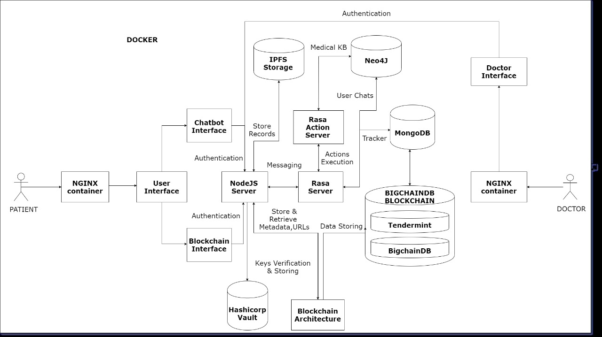
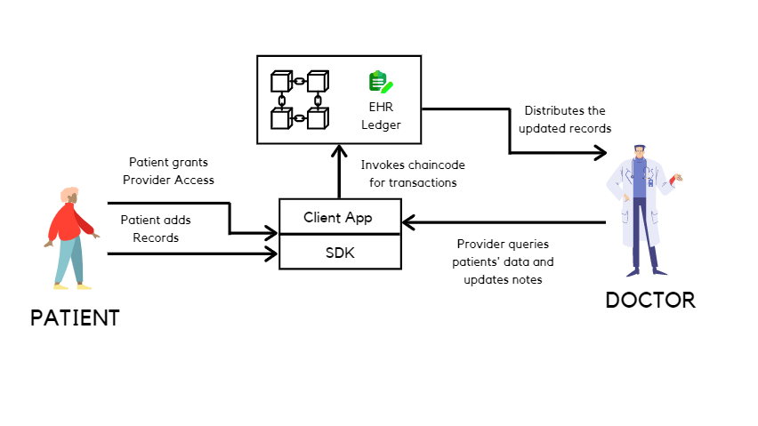
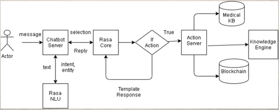
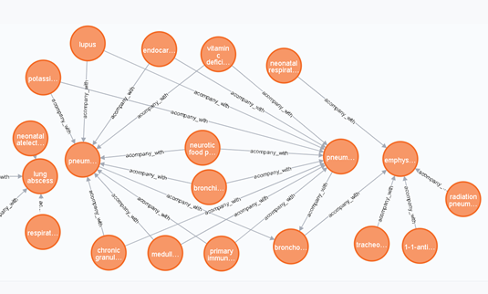
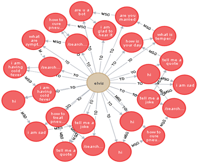
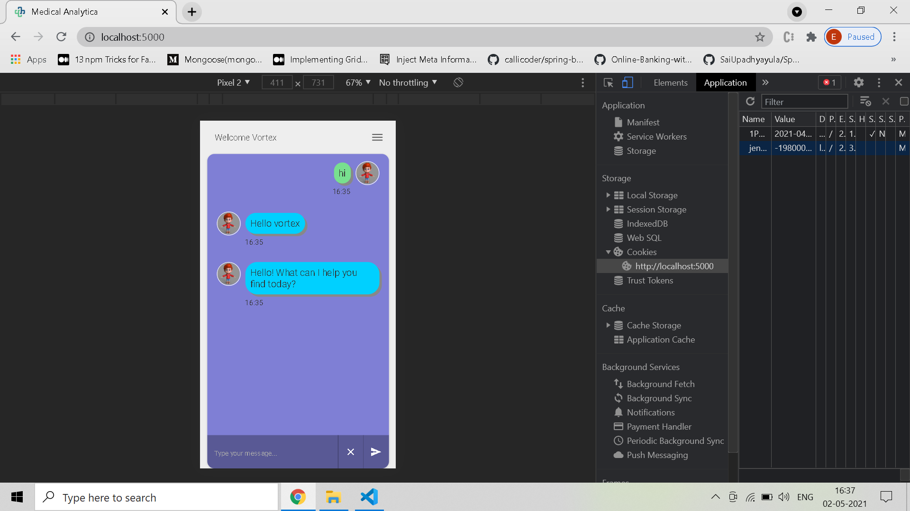

# Leveraging Conversational AI for Secure Healthcare Assistance
Access control of medical records using BigchainDB, IPFS & RASA

# Table of Contents

* [Description](https://github.com/ejson03/Medical-Chatbot#description)
* [Installation](https://github.com/ejson03/Medical-Chatbot#installation)
* [Output](https://github.com/ejson03/Medical-Chatbot#output)
* [Contributors](https://github.com/ejson03/Medical-Chatbot#contributors)
* [License](https://github.com/ejson03/Medical-Chatbot#license)

# Description

There is a rapid increase in generation of medical data especially in a situation of medical emergency or crisis. When hospitals are understaffed to maintain healthcare data, they are prone to be tampered with. Users do not recieve their medical information on time and cannot approach other institutions quickly with their medical history.

* Solution: Bring EHR to blockchain

BigchainDB is a decentralized database that has immutability just like traditional blockchains. We have attempted to develop an end to end system for succesful storage, transfer and tracking of patient healthcare data. All records are encrypted using AES-256 encryption and the access for this data is transferred through blockchain and assymetric cryptography. Due to limited blockchain data storage, files are being stored in IPFS.

There is a wave of emotional unstabiltiy among people who are on a downward spiral in life or are going through hard times. We have developed a chat companion to make the user feel better and to track analysis of users behaviour. Chatbot as a compnion can provide you factual informatio

This project as a chatbot is a part of our complete project 

[Medical Analytica](https://github.com/ejson03/Medical-Analytica)


# Installation

Clone the repository
```
git clone https://github.com/ejson03/Medical-Analytica.git
```

## To build without Docker

Make virtual env
```
python3 -m venv rasa
```


Using eveything in Docker 
```
./scripts/build_docker.bat
```

or 


Running rasa and node in local 
```
./scripts/build_local.bat
```

or

To just run local servers if local and start docker
```
./scripts/local.bat
```

or 


To just run local servers if local 
```
./scripts/runserver.bat
```

## Run everything on docker

```
docker-compose up -d --build 
```


Essential docker commands
```
docker build -t <container-name> .
docker run -t <container-name> -p <port>:<port> [ -d for silent]
docker system prune -a (remove all containers)
docker ps (check running containers)
docker stop <container-id>  (stop single container)
docker rm <container-id> (remove single container)
docker rmi <image-id> (remove image)
docker container stop $(docker container ls -aq) (stop all containers)
docker container rm $(docker container ls -aq) (remove all containers)
docker container inspect <container-id>
```

# Output

## System Architecture


## Blockchain Architecture


## Chabot Architecture


## Medical Knowledge Graph


## User Knowledge Graph


## Mobile responsive


## Project PPT
[Project PPT Link](https://drive.google.com/file/d/1iaLDXMwqxdpMxPkBEmPbYyMyF46ZgYbZ/view?usp=sharing)

## Project Report
[Project Report Link](https://drive.google.com/file/d/1PQ-2ZngP3t9lCNq4PN4uc4mj5OoCK6cq/view?usp=sharing)

## Project Video  Link
[Video Link](https://drive.google.com/file/d/1t38fBO57A_LC4QA8xdyfBVDmnpVRFu6E/view?usp=sharing)


# Contributors

* Vedant Sahai [@Vedantsahai18](https://github.com/Vedantsahai18)
* Elvis Dsouza [@ejson03](https://github.com/ejson03)
* Pratik Chowdhury [@pratikpc](https://github.com/pratikpc)

In order to contribute please create a ```PULL REQUEST```, we will go through it and if all looks good, it will be accepted.

# License

[](https://opensource.org/licenses/MIT)

[MIT License Link](https://github.com/ejson03/Medical-Analytica/blob/master/LICENSE)


